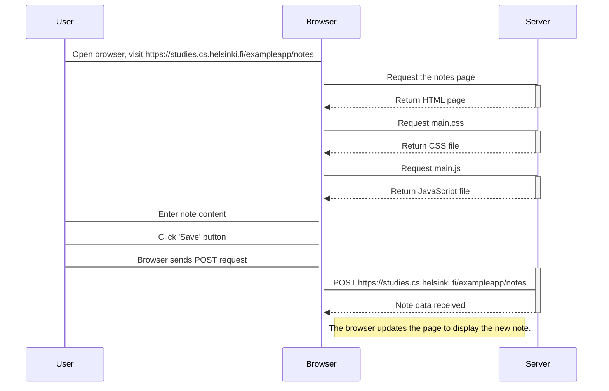

```mermaid
sequenceDiagram
    participant User
    participant Browser
    participant Server

    User->Browser: Open browser, visit https://studies.cs.helsinki.fi/exampleapp/notes
    activate Browser
    Browser->Server: Request the notes page
    activate Server
    Server-->>Browser: Return HTML page
    deactivate Server
    Browser->Server: Request main.css
    activate Server
    Server-->>Browser: Return CSS file
    deactivate Server
    Browser->Server: Request main.js
    activate Server
    Server-->>Browser: Return JavaScript file
    deactivate Server

    User->Browser: Enter note content
    User->Browser: Click 'Save' button
    User->Browser: Browser sends POST request
    activate Server
    Browser->Server: POST https://studies.cs.helsinki.fi/exampleapp/notes
    Server-->>Browser: Note data received
    deactivate Server

    Note right of Browser: The browser updates the page to display the new note.


```