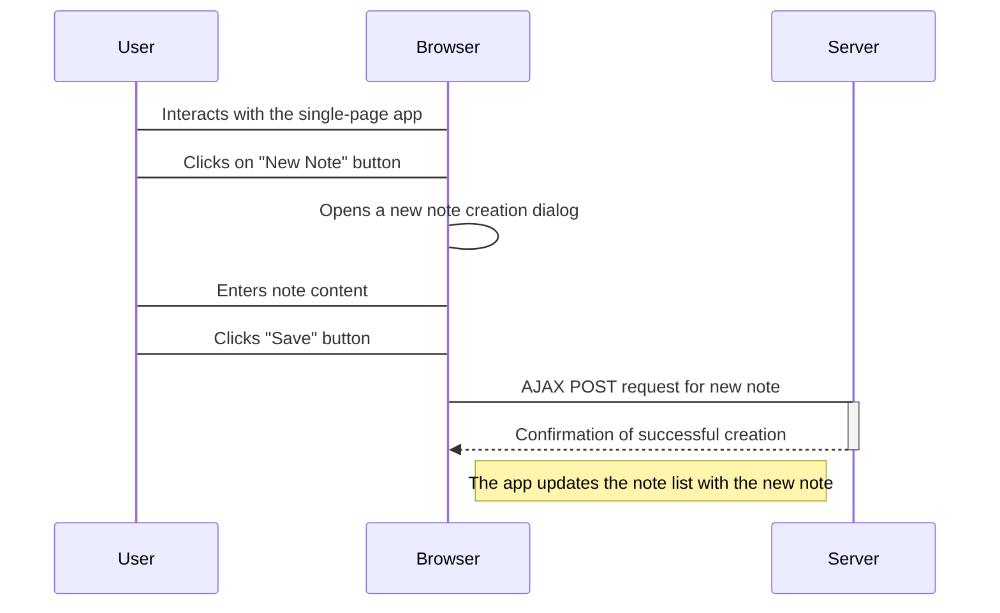

```mermaid
sequenceDiagram
    participant User
    participant Browser
    participant Server

    User->Browser: Interacts with the single-page app
    User->Browser: Clicks on "New Note" button
    Browser->Browser: Opens a new note creation dialog

    User->Browser: Enters note content
    User->Browser: Clicks "Save" button
    Browser->Server: AJAX POST request for new note
    activate Server
    Server-->>Browser: Confirmation of successful creation
    deactivate Server

    Note right of Browser: The app updates the note list with the new note
```

